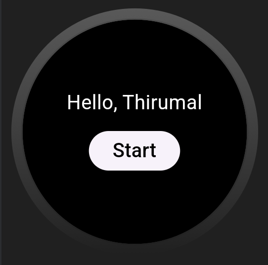
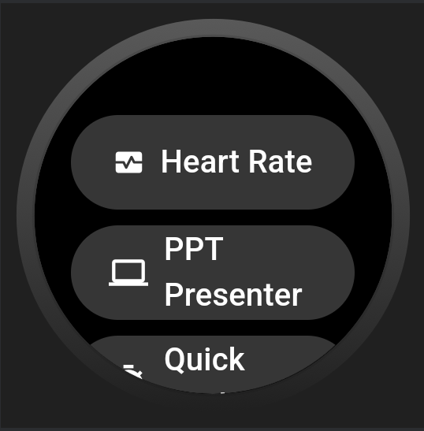
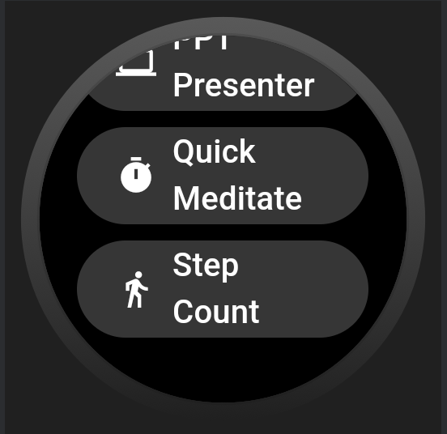
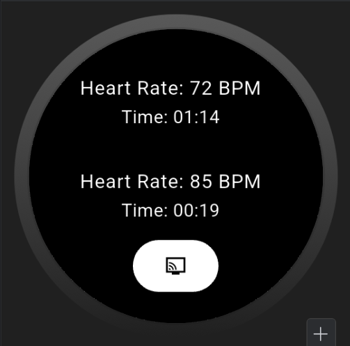
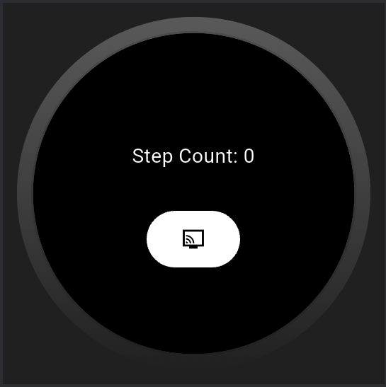
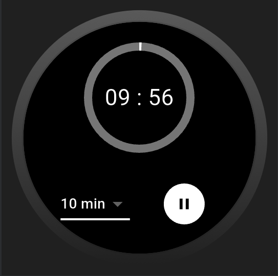
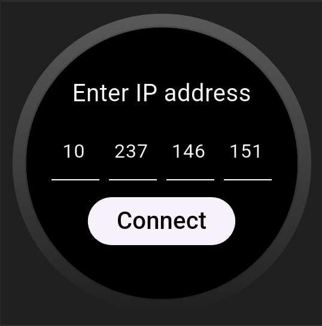
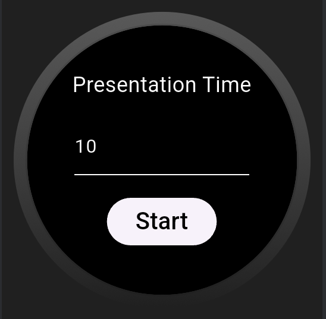
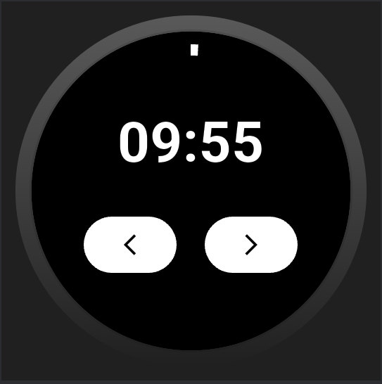
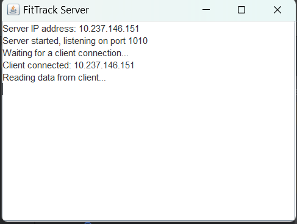

# ⌚ FitTrack – Wearable Assistant

FitTrack is an **Android companion application** built with **Flutter** that works with a wearable device to provide **health tracking** and **smart utilities**.  
The project also includes a **Java-based server** for controlling PowerPoint presentations over a local WiFi network.

---

## 🖼️ Project Overview

  
*Introductory screen of the FitTrack companion app*

---

## 🏠 Home Page


  
*Main home screens of the app*

---

## ✨ Features

### ❤️ Heart Rate Monitoring
  
*Real-time tracking with data stored in Firebase*

### 👣 Step Count Tracking
  
*Tracks activity and syncs to Firebase*

### 🧘 Quick Meditate Timer
  
*Simple mindfulness timer for short breaks*

---

## 🖥️ PPT Presenter

Control presentations directly from the wearable app.  
Works via a **Java server** using **socket programming**.  
Both the watch and server must be on the **same WiFi network**.

### Screenshots




---

## 🖧 Java Server

A lightweight Java server handles incoming socket connections from the watch and controls PowerPoint slides.



---

## 🏗️ Tech Stack

- **Frontend (Companion App):** Flutter (Dart)  
- **Backend (Data Storage):** Firebase Realtime Database  
- **Server (PPT Control):** Java with Socket Programming  
- **Platform:** Android (Wear OS Companion App)  

---

## ⚙️ How It Works

1. The **wearable companion app** (built with Flutter) collects health and control data.  
2. **Firebase** stores and syncs health data such as heart rate and step count.  
3. The **Java server** listens for control signals from the watch to manage PowerPoint presentations.  
4. The PPT presenter feature requires both the **watch** and **server** to be on the same **WiFi network**.  

---

## 🚀 Getting Started

1. Clone the repository:  
   ```bash
   git clone https://github.com/123thirumal/FitTrack.git
